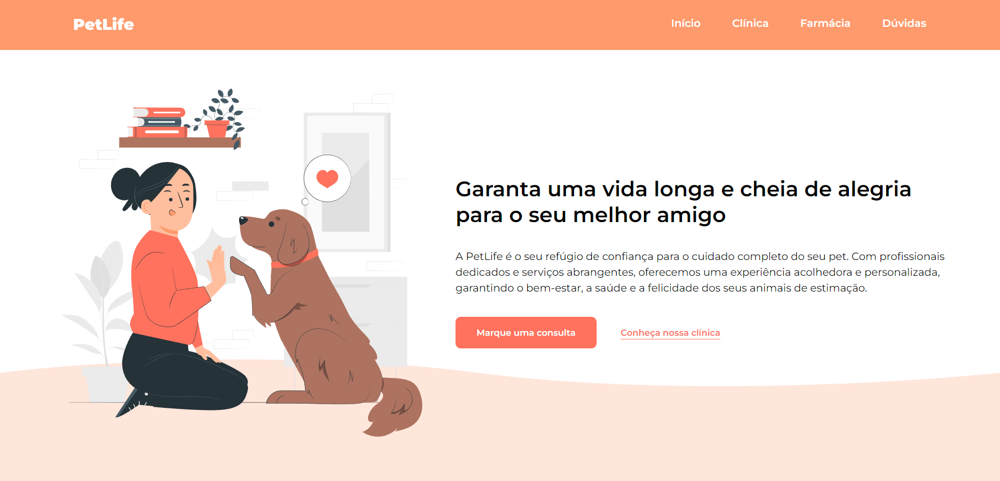
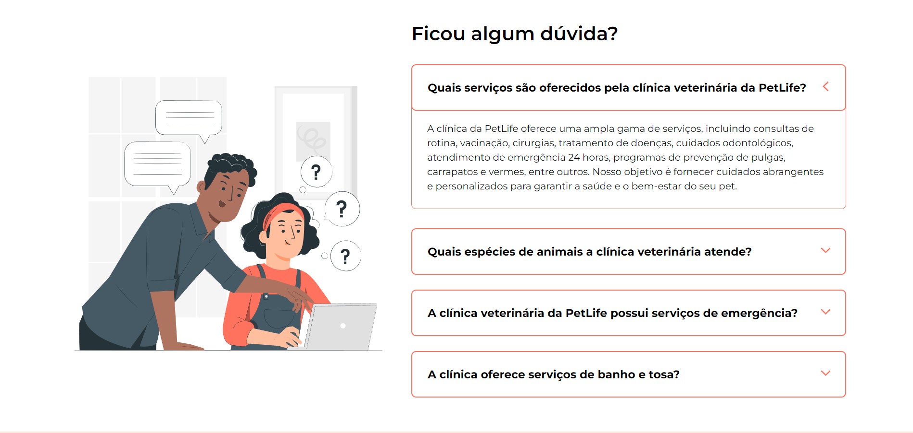
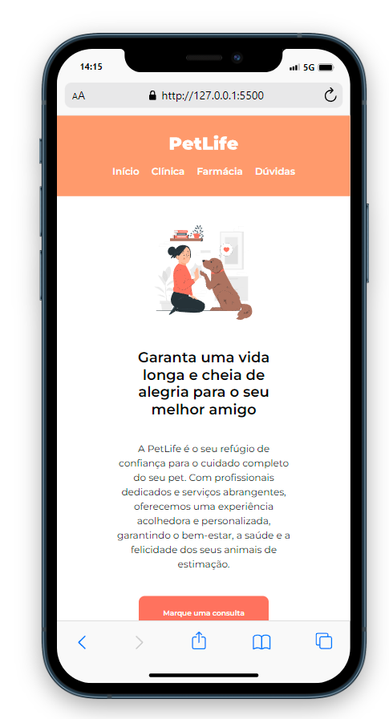

# PetLife

Este é um projeto de site chamado PetLife, desenvolvido para fornecer informações sobre uma clínica veterinária fictícia chamada PetLife. O site foi criado usando HTML, Sass (CSS pré-processado), JavaScript e a fonte Montserrat do Google Fonts.

## Visão Geral

A PetLife é apresentada como um refúgio de confiança para o cuidado completo de animais de estimação, oferecendo serviços veterinários, petshop e farmácia. Este site visa promover a clínica, apresentar seus serviços e criar um canal para os clientes marcarem consultas.

## Funcionalidades

* Seções informativas sobre a clínica, serviços e petshop/farmácia.
* Botão "Marque uma consulta" que direciona para o WhatsApp para agendar consultas.
* Seção de perguntas frequentes (FAQ) com respostas expansíveis ao clicar.
* Links rápidos na parte inferior para navegar facilmente pelo site.
* Informações de contato, incluindo WhatsApp, e-mail e endereço da clínica.
* Rodapé com créditos do desenvolvedor.

## Tecnologias Usadas 

* HTML
* SASS
* JAVASCRIPT
* GOOGLE FONTS 

## Como Usar 

1. Abra o arquivo `index.html` em seu navegador da web.
2. Explore as diferentes seções do site usando a navegação no cabeçalho.
3. Clique nos botões para obter mais informações sobre a clínica, petshop e farmácia.
4. Utilize o botão "Marque uma consulta" para ser direcionado ao WhatsApp da clínica.
5. Na seção de dúvidas, clique nas perguntas para expandir ou recolher as respostas.
6. Verifique os links rápidos no rodapé para navegar para diferentes partes do site.

## Estrutura do Projeto

* `index.html`: A página HTML principal que contém a estrutura do site.
* `assets/img`: Pasta contendo arquivos de imagens.
* `src/sass/style.scss`: O arquivo principal de estilo escrito em Sass.
* `src/sass/partials/`: Pasta contendo arquivos parciais Sass para modularização.
* `src/js/script.js`: O arquivo JavaScript que adiciona funcionalidades interativas.

## Links

[GitHub](https://github.com/manoelarcanjo/LandingPage-PetLife)  
[Deploy](https://landingpagepetlife.vercel.app)

## O Projeto

</img>
</img>
</img>